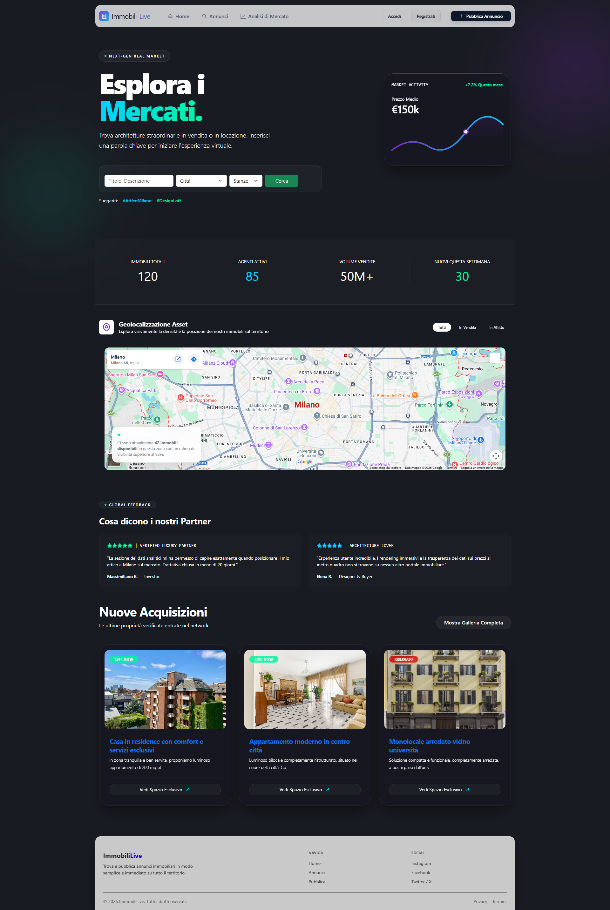
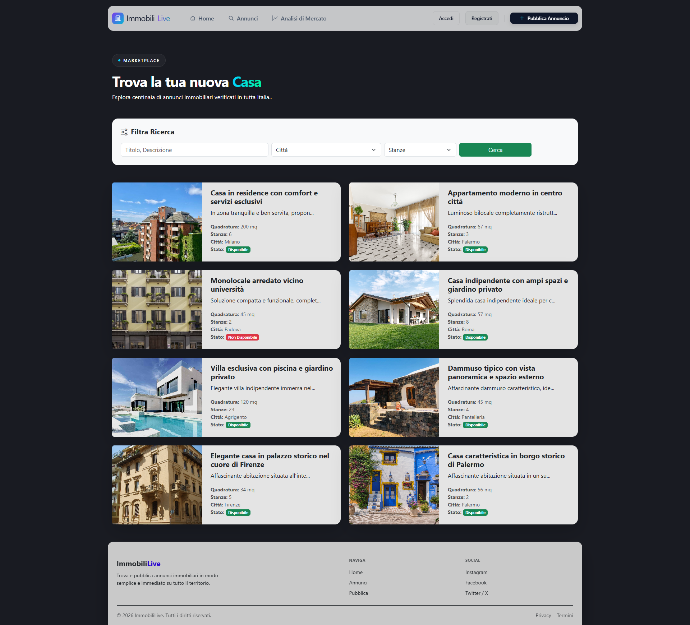
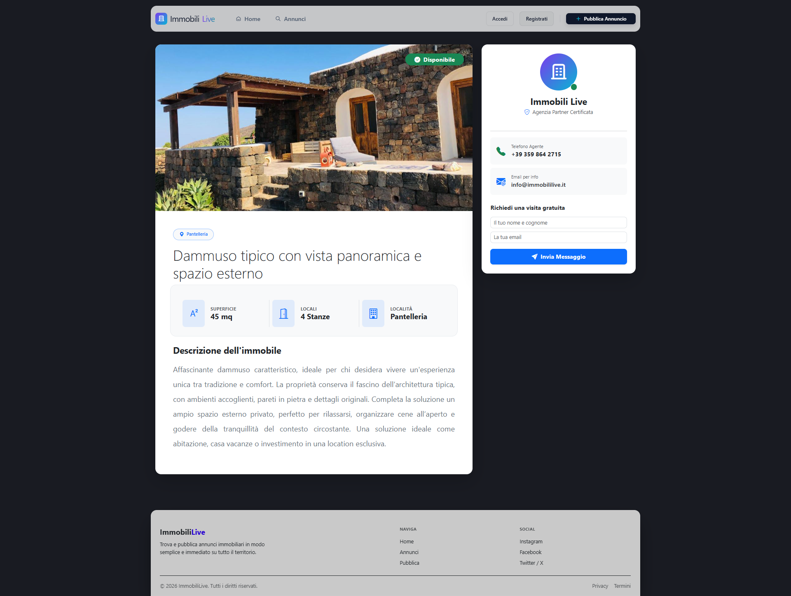
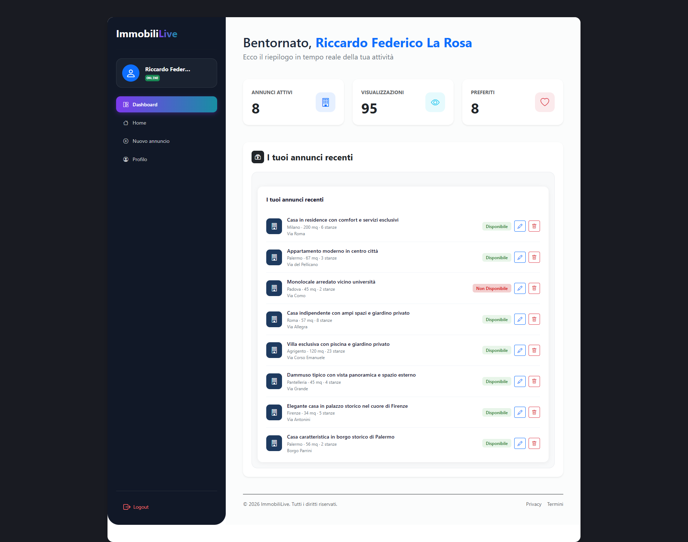
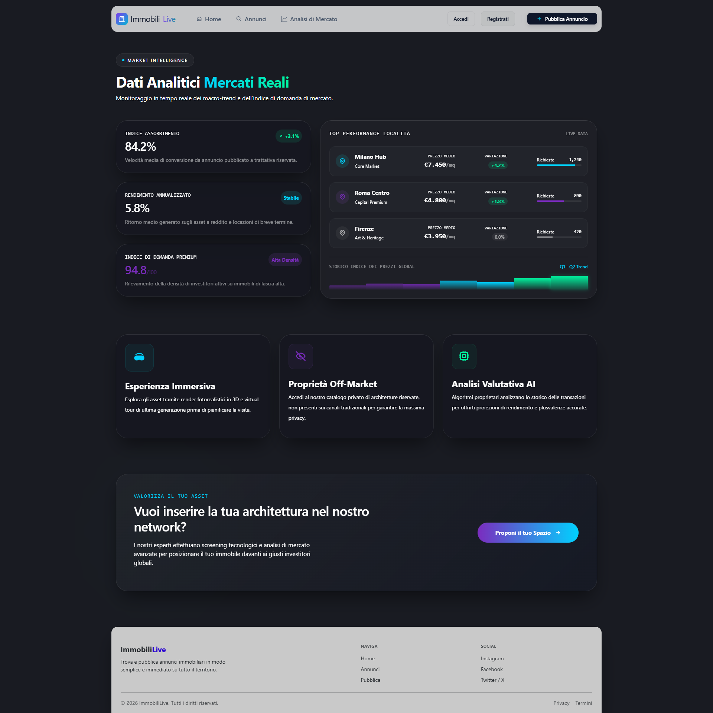
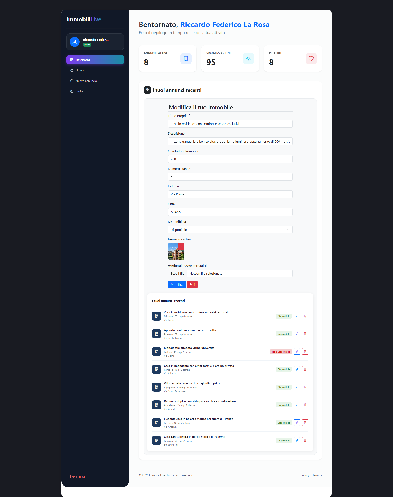

# 🏠 Web-Immobiliare
Piattaforma immobiliare full-stack per la pubblicazione, ricerca e gestione di annunci in tutta Italia.
Gli utenti registrati pubblicano i propri immobili, li gestiscono dalla dashboard personale e possono ricevere richieste di visita direttamente dalla pagina dell'annuncio.


---

## Screenshot

**Homepage** — hero con ricerca, mappa interattiva, nuove acquisizioni e testimonianze



**Annunci** — griglia card con immagine, stato disponibilità e filtri per città e stanze



**Dettaglio immobile** — galleria, specifiche tecniche e form di contatto per richiedere una visita



**Dashboard utente** — riepilogo annunci attivi, visualizzazioni e preferiti



**Analisi di mercato** — indici di assorbimento, rendimento annualizzato e top locality per area



---

## Funzionalità

- Autenticazione completa con Laravel Fortify (registrazione, login, reset password)
- Pubblicazione annunci con upload multiplo di immagini
- Ricerca per titolo, città e numero di stanze
- Dashboard personale con riepilogo attività in tempo reale
- Modifica e cancellazione annunci tramite componenti **Livewire** (senza ricaricare la pagina)
- Form di contatto integrato nella pagina dell'annuncio per richiedere una visita
- Mappa interattiva in homepage per la geolocalizzazione degli asset
- Pagina Analisi di Mercato con dati su indici immobiliari e performance per locality
- Design dark-mode completamente custom, responsive su tutti i dispositivi

---

## Tech Stack

| Layer | Tecnologie |
|-------|-----------|
| Backend | PHP 8, Laravel |
| Autenticazione | Laravel Fortify |
| Frontend dinamico | Livewire |
| Template engine | Blade |
| Stile | Bootstrap 5, CSS custom |
| Database | MySQL 8 |

---

**Prerequisiti:** PHP 8+, Composer, MySQL

```bash
git clone https://github.com/RiccardoLaRosa/Web-Immobiliare.git
cd Web-Immobiliare
composer install
cp .env.example .env
php artisan key:generate
php artisan migrate --seed
php artisan storage:link
php artisan serve
```

### Credenziali di test

| Ruolo | Email | Password |
|-------|-------|----------|
| Utente | test@example.com | password |

> Modifica i valori nel seeder se differenti.

---

## Struttura del progetto

```
app/
├── Http/Controllers/   # Controller per annunci, dashboard, mercato
├── Livewire/           # Componenti Livewire (edit inline, listing)
└── Models/             # Immobile, User, Image
resources/views/
├── layouts/            # Layout principale con navbar e footer
├── immobili/           # Index, show, create, edit
├── dashboard/          # Dashboard utente
└── mercato/            # Pagina analisi di mercato
database/
└── migrations/
```

---

## Galleria

<table>
  <tr>
    <td align="center"><b>Homepage</b></td>
    <td align="center"><b>Annunci</b></td>
  </tr>
  <tr>
    <td></td>
    <td></td>
  </tr>
  <tr>
    <td align="center"><b>Dettaglio immobile</b></td>
    <td align="center"><b>Dashboard utente</b></td>
  </tr>
  <tr>
    <td></td>
    <td></td>
  </tr>
  <tr>
    <td align="center"><b>Modifica annuncio</b></td>
    <td align="center"><b>Analisi di mercato</b></td>
  </tr>
  <tr>
    <td></td>
    <td></td>
  </tr>
</table>

---

## Autore

**Riccardo Federico La Rosa**

[](https://www.linkedin.com/in/riccardo-federico-la-rosa-4999551ab/)
[](https://github.com/RiccardoLaRosa)
